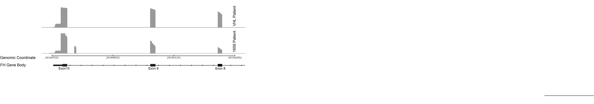

# Introduction
This notebook describes the workup, sequencing, and mapping of Nanopore libraries for the Linehan Exon9A project. 

# 1. Sample Workup
1) Samples were collected by D. Crooks from 15 cm plates. (2 replicates each VHL and 1656 patient)
2) Total RNA was extracted from trizol by C. Fitzsimmons following manufacturer's RNA extraction protocol
3) Samples underwent 2 rounds of polyA selection using NEB Oligo d(T)25 beads and protocol. 
4) RNA precipitated overnight using 1 uL glycoblue reagent, 1/10th volume 3.5 M sodium acetate, 2.5 volumes 100% Ethanol
5) PolyA mRNA was quantified by both Qubit and quality assessed by RNA tape station.
6) 750 ng of each sample was lyophilized to a final volume of 9 uL to use as input for library construction


# 2. Library Construction and sequencing
Library Prep following Oxford Nanopore Instructions and SQK-R002 direct RNA sequencing kit.   
Version: DRS_9080_v2_revH_14Aug2019

#### Protocol overview in brief: 
1) First-strand synthesis with superscript III
2) Motor protein and adapter ligation
3) library cleanup via Ampure beads
4) Library quantification via Qubit

|Date|Sample|Input amount (ng)|Library Kit Batch| Flow Cell Lot | Flow Cell ID | Run Length (hr)|
|:----|:----|:-----|:-----|:-----|:-----|:----|
|2019-11-19| VHL-A | 750 | SN02.10.0005 0551 | 11001054 | FAL66420 | 60|
|2019-11-22| 1656-A | 750| SN02.10.0005 0551 | 11001028 | FAL53982| 60 |
|2019-11-25| VHL-B | 750|SN02.10.0005 0551 | 11000987 | FAL24716 | 60 |
|201-12-03| 1656-B | 750|SN02.10.0005 0551 | 11001028 | FAL53593 | 60|

# 3. Nanopore Data Quality Control
`MinION QC/v.1.4.1` was run locally from the command line using the summary.txt files to generate QC plots of Nanopore data. 
The resulting plots were compared to previous data to look at read-length distribution and quality scores of the VHL and 1656 samples. 

# 4. Basecalling and mapping
#### Basecalling
Raw fast5 data was basecalled with `guppy/3.4.5` using gpu nodes on the Biowulf cluster:

` sbatch --partition=gpu ----gres=gpu:p100:2 --cpus-per-task=12 --mem=30g --time=24:00:00`

```{bash, eval = FALSE}
#!/bin/bash
set -e

module load  guppy/3.4.5
guppy_basecaller --input_path /data/BatistaLab_NGS/Nanopore_pilot/DC1656_20190904/VHL-A/20191119_1905_MN31566_FAL66420_39699599/fast5_pass \
  --save_path /data/BatistaLab_NGS/Nanopore_pilot/DC1656_20190904/guppy_basecalled/VHL_A \
  --flowcell FLO-MIN106 \
  --kit SQK-RNA002 \
  --cpu_threads_per_caller $SLURM_CPUS_PER_TASK \
  -x auto
```
#### Mapping
Basecalled fastq files were concatenated and mapped against the hg38 genome on the Biowulf using `minimap2/2.17` with the following command:

`sbatch --cpus-per-task=12 --mem=35g`
```{bash, eval=FALSE}
#!/bin/bash
set -e

module load minimap2
minimap2 -ax splice -uf -k14 /data/BatistaLab_NGS/annotations/GRCh38.p12.genome.fa /data/BatistaLab_NGS/Nanopore_pilot/DC1656_20190904/guppy_basecalled/VHL_A/VHL_A.fastq > VHLA_guppycall_hg38genome_map.sam

```
# 5. Visualization
Mapped sam files were indexed and visualized with `IGV/2.8.0` using the in-application `igvtools` features. FH was visualized between exons 9 and exon 10. Alternative splicing plots were generated using the in-application `Sashimi Plot` feature: 

<div style="width:1600px; height:1200px"></div>


